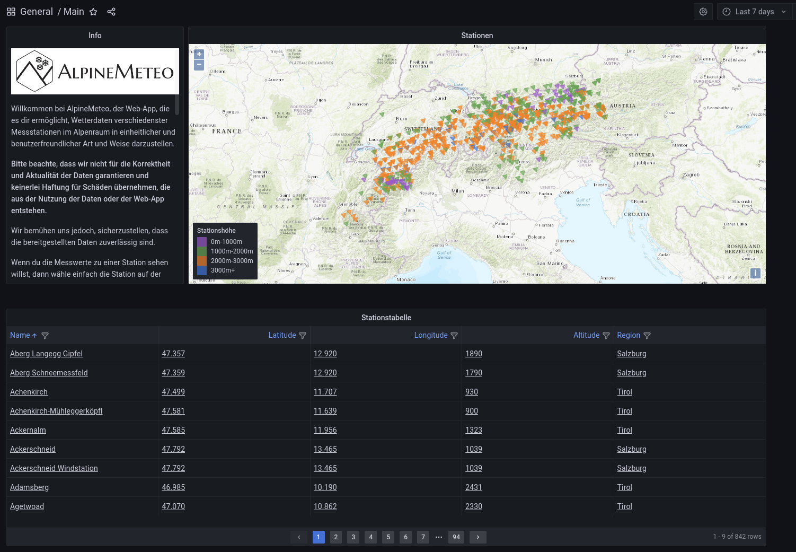
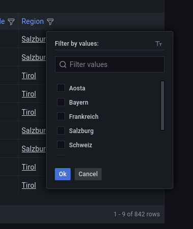
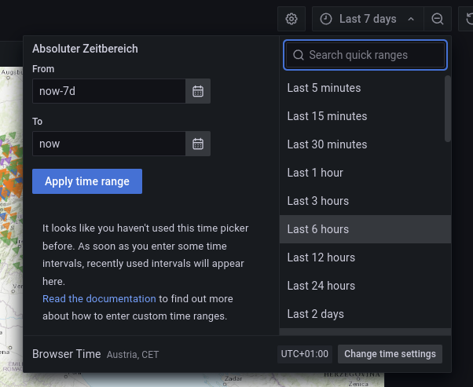

Main-Dashboard
==================================================

Im Main-Dashboard werden alle Stationen in Form einer Tabelle und
auf einer Karte dargestellt angezeigt.

Die Einträge der Tabelle können nach verschiedenen Punkten gefiltert 
und sortiert werden. Zum Beispiel können mit einem Klick auf "Region",
verschiedene Regionen ein-/ausgeschlossen werden. 

Alle angezeigten Stationen enthalten mindestens einen Messwert in
der vom Benutzer festgelegten Zeitspanne. Die Zeitspanne kann 
rechts oben definiert werden.

Die Messstationen, welche in der Karte und der Tabelle dargestellt sind, 
verlinken auf das Station-Dashboard. Das Station-Dashboard zeigt die Messwerte
für die gewählte Station an. Die Zeitspanne, welche im Main-Dashboard gewählt 
wurde, wird dabei übernommen. 
