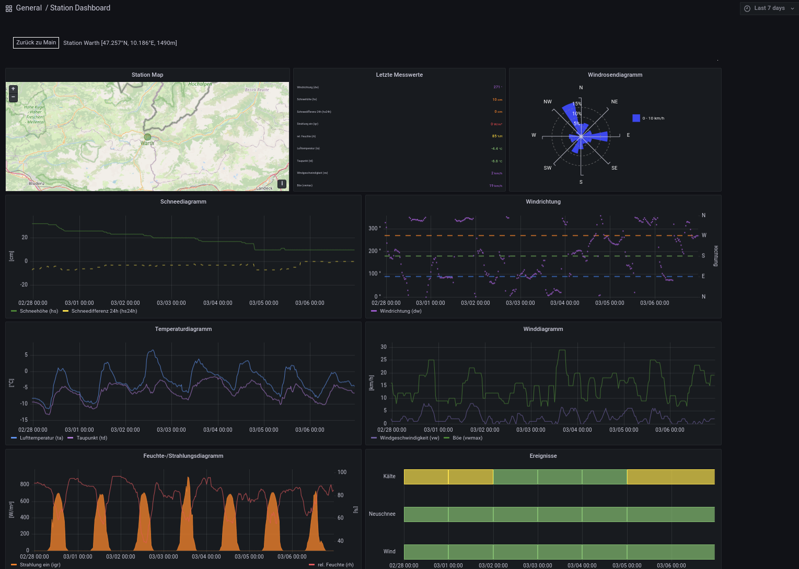

Station-Dashboard
===================

Das Station-Dashboard besteht aus neun Elementen, welche die verschiedenen
Informationen der Messstationen in aufbereiteter Form darstellen.

Da nicht alle Werte von allen Messstation erfasst werden, ist es normal,
dass manche Anzeigeelemente nicht mit Daten befüllt sind (z.B. wenn eine
Messstation keine Winddaten erfasst).

Die Anzeigeelemente umfassen:

* Station Map: Die Position der Messstation wird in einer Karte dargestellt.
* Letzte Messwerte: Die letzten Messwerte der Station.
* Für den gewählten Zeitbereich werden in gesonderter Form dargestellt:

  * Windrosendiagramm: Zeigt Verteilung der Windrichtung und Windgeschwindigkeit an.
  * Schneediagramm: Stellt Schneehöhe und 24h Schneedifferenz dar.
  * Windrichtung: Windrichtung in Grad und Himmelsrichtung.
  * Temperaturdiagramm: Stellt (je nach Verfügbarkeit) die Lufttemperatur, Oberflächentemperatur und den Taupunkt dar.
  * Winddiagramm: Zeigt Verlaufskurven für Wind- und Böengeschwindigkeit an.
  * Feuchte-/Strahlungsdiagramm: Stellt Verläufe von eingehender und ausgehender Strahlung und relative Luftfeuchtigkeit dar.
  * Ereignisse: Analysiert Messwerte für 24h Intervalle (48 Messpunkte) und berechnet eine farbliche Indikation für folgende Faktoren

    * Kälte: Visualisiert Kältetage. Ein Kältetag wird angenommen wenn 1/3 der Messwerte unter folgenden Temperaturen liegt

      * <-5°C: Kältetag level gelb
      * <-10°C: Kältetag level orange
      * <-20°C: Kältetag level rot
      
    * Wind: Visualiert Situationen mit erhöhter Windaktivität. Eine erhöhte Windaktivität wird angenommen, wenn Messpunkte vorhanden sind, welche überhalb folgender Schwellwerte liegen

      * >=20km/h und <45km/h: Windaktivität level gelb
      * >=45km/h und <70km/h: Windaktivität level orange
      * >=70km/h: Windaktivität level rot
      
    * Neuschnee: Liefert Informationen zu Neuschnee. Neuschneesituation wird angenommen wenn in der 24h Periode folgende Neuschnee-Levels überschritten werden

      * >3cm und <=20cm: Neuschnee level gelb
      * >20cm und <=50cm: Neuschnee level orange
      * >50cm: Neuschnee level rot
