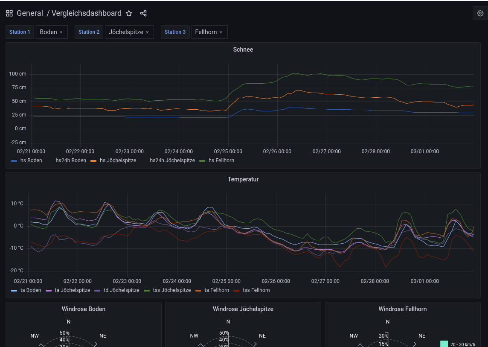

Vergleichs-Dashboard
==================================================

Messstationen können bei Bedarf miteinander verglichen werden. Dies
dient zum Beispiel zur Visualisierung der Schneehöhenkurven verschiedener 
Messstationen nach einer Schneefallperiode.

Um einen Vergleich durchzuführen, werden bis zu drei gewünschte Stationen
in den dafür vorgesehenen Feldern ausgewählt. Die verschiedenen Messwerte können
bei Bedarf farblich verändert oder ausgeblendet werden.